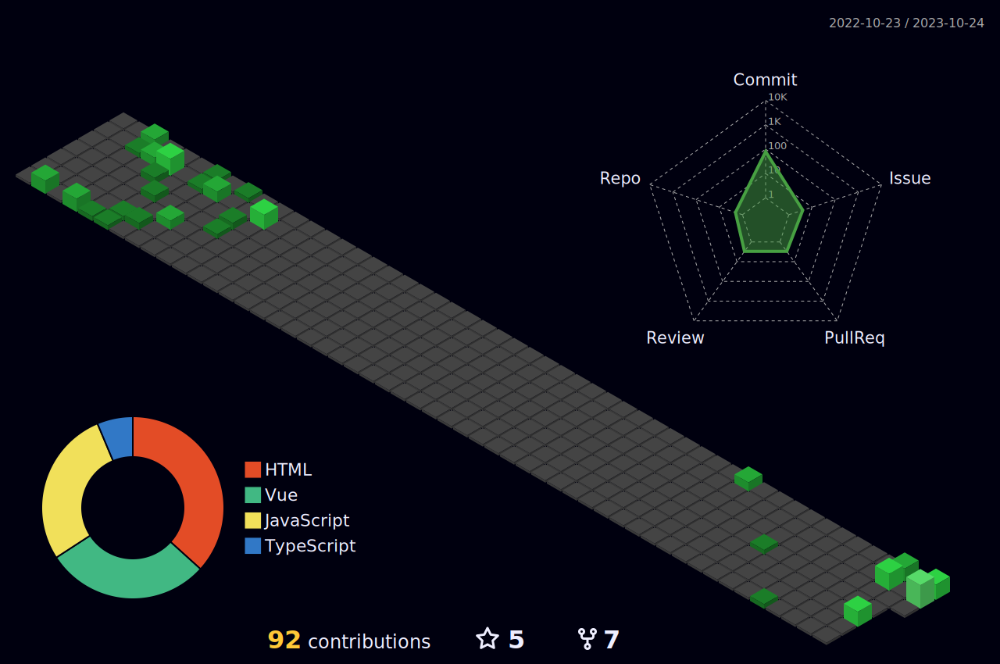

### Hi, I'm Lulu 👋

😄 I'm currently a software developer at [backstitch](https://www.linkedin.com/company/backstitch/about/), a SaaS company focused on enhancing HR communication with employees. Before that, I worked at [Dimensional Innovations](https://dimin.com/) where I implemented web designs and developed CMS and API for various clients. My key clients included Kansas City International Airport, St. Louis Cardinals, Children's Healthcare of Atlanta, and the University of Nebraska.

🍀 I volunteered as TechTalks Program Director for [Kansas City Women in Technology](https://www.eventbrite.com/o/kansas-city-women-in-technology-4568105457), connecting with local speakers and sponsors and organizing monthly Tech Talks. I also volunteered with them as Coding and Cocktails Curriculum Director, developing curricula on CSS, JavaScript, and GitHub Action.

🌱 I volunteered for the Code for KC program with [KC Digital Drive](https://www.kcdigitaldrive.org/) and developed a [TrashTracker](https://github.com/codeforkansascity/TrashTrackerWebApp) project to track community reports of illegal dumping.

⚡ Fun fact: I studied philosophy for three years and co-founded a startup for a social media platform - Symposia.

<!--  -->
### My GitHub activities

	<picture>
	  <source media="(prefers-color-scheme: dark)" srcset="https://raw.githubusercontent.com/lulu-cao/lulu-cao/output-3d-contrib/night.svg" />
	  <source media="(prefers-color-scheme: light)" srcset="https://raw.githubusercontent.com/lulu-cao/lulu-cao/output-3d-contrib/day.svg" />
	  
	</picture>

<!--  -->

### Books I'm currently reading
<!-- GOODREADS-LIST:START -->
- [Aftermath: Violence and the Remaking of a Self](https://www.goodreads.com/review/show/8025915894?utm_medium=api&utm_source=rss) by Susan J. Brison (⭐️4.38)
- [Do Nothing: How to Break Away from Overworking, Overdoing, and Underliving](https://www.goodreads.com/review/show/7636053654?utm_medium=api&utm_source=rss) by Celeste Headlee (⭐️3.83)
- [The Inspired Houseplant: Transform Your Home with Indoor Plants from Kokedama to Terrariums and Water Gardens to Edibles](https://www.goodreads.com/review/show/7396004093?utm_medium=api&utm_source=rss) by Jen Stearns (⭐️3.84)
<!-- GOODREADS-LIST:END -->

<!--STARTS_HERE_QUOTE_README-->
<!--ENDS_HERE_QUOTE_README-->
<i><b>Last Updated at</b></i>&nbsp;<!-- LAST-UPDATE:START -->
Sun  08 Jun 2025
<!-- LAST-UPDATE:END -->

