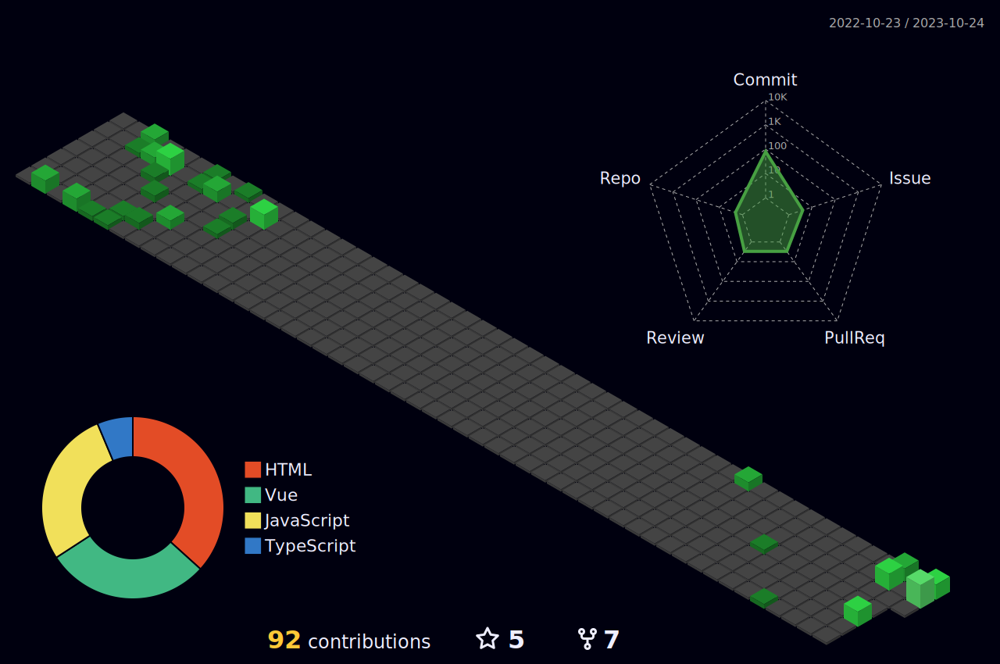

### Hi, I'm Lulu 👋

😄 I'm currently a software developer at [backstitch](https://www.linkedin.com/company/backstitch/about/), a SaaS company focused on enhancing HR communication with employees. Before that, I worked at [Dimensional Innovations](https://dimin.com/) where I implemented web designs and developed CMSs and APIs for various clients. My key clients included Kansas City International Airport, St. Louis Cardinals, Children's Healthcare of Atlanta, and the University of Nebraska.

🍀 I volunteered as TechTalks Program Director for [Kansas City Women in Technology](https://www.eventbrite.com/o/kansas-city-women-in-technology-4568105457), connecting with local speakers and sponsors and organizing monthly Tech Talks. I also served as Coding & Cocktails Curriculum Director, developing curricula on JavaScript, CSS, and GitHub Actions.

🌱 I volunteered with the Code for KC program through [KC Digital Drive](https://www.kcdigitaldrive.org/), where I helped develop [TrashTracker](https://github.com/codeforkansascity/TrashTrackerWebApp), a project for tracking community reports of illegal dumping.

⚡ Fun fact: I studied and taught philosophy before switching to programming.

<!--  -->
### My GitHub activities

	<picture>
	  <source media="(prefers-color-scheme: dark)" srcset="https://raw.githubusercontent.com/lulu-cao/lulu-cao/output-3d-contrib/night.svg" />
	  <source media="(prefers-color-scheme: light)" srcset="https://raw.githubusercontent.com/lulu-cao/lulu-cao/output-3d-contrib/day.svg" />
	  
	</picture>

<!--  -->

### Books I'm currently reading
<!-- GOODREADS-LIST:START -->
- [Blue and Yellow Don't Make Green: Or, How To Mix the Colour You Really Want-Every Time](https://www.goodreads.com/review/show/8294648375?utm_medium=api&utm_source=rss) by Michael Wilcox (⭐️4.12)
- [Aftermath: Violence and the Remaking of a Self](https://www.goodreads.com/review/show/8025915894?utm_medium=api&utm_source=rss) by Susan J. Brison (⭐️4.37)
- [The Inspired Houseplant: Transform Your Home with Indoor Plants from Kokedama to Terrariums and Water Gardens to Edibles](https://www.goodreads.com/review/show/7396004093?utm_medium=api&utm_source=rss) by Jen Stearns (⭐️3.85)
<!-- GOODREADS-LIST:END -->

<!--STARTS_HERE_QUOTE_README-->
<!--ENDS_HERE_QUOTE_README-->
<i><b>Last Updated at</b></i>&nbsp;<!-- LAST-UPDATE:START -->
Sat  24 Jan 2026
<!-- LAST-UPDATE:END -->

